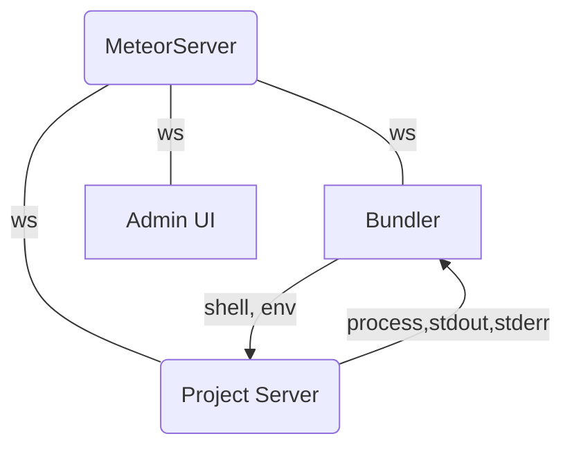

# Project server

```mermaid
graph TD

    Bundler[Bundler]
    Project(Project Server)
    Server(MeteorServer)
    Admin[Admin UI]

    Bundler -->|shell, env| Project
    Project --> |process,stdout,stderr| Bundler
    Server --- |ws| Project
    Server --- |ws| Admin 
    Server --- |ws| Bundler 

```
