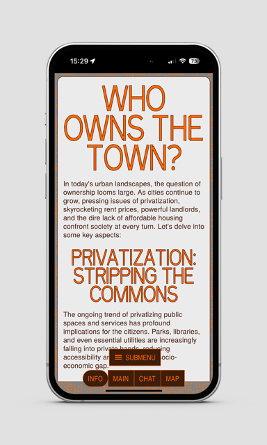

# Building Blocks by Knoth & Renner

Stapeln, Mauern, Legen — das Theme »Building Blocks« beschäftigt sich mit urbanen Perspektiven und städtebaulichen Formaten. Platzsparende Typografie und große, raumgreifende Grafiken in unterschiedlichen Lautstärken machen Platz für diverse Inhalten, die sich mit Themen wie Stadt, Verkehr und Gesellschaft auseinandersetzen.

