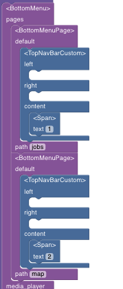
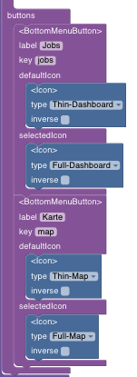

# BottomMenu

The BottomMenu is often used as the main navigation for apps. 
Research has found that most users use their phones with one hand. When they hold their phone, they’ll use either their right or left thumb to interact with the screen. The thumb is like the user’s mouse but with limitations. The bottom is the easiest to reach.
For a bottom menu you should place high priority options at the bottom. This makes them quicker to reach and tap.

Here's the BottomMenu in the context of an interkit app:

## How to Build

Use the `BottomMenu` component together with `BottomMenuPage` and `BottomMenuButton` to construct a row of buttons on the bottom that select different screens.

Arrange the components in the following way. This is an example with two buttons and two pages.

- BottomMenu
  - pages
    - BottomMenuPage
      - TopNavBarCustom
    - BottomMenuPage
      - TopNavBarCustom
  - buttons
    - BottomMenuButton
      - defaultIcon: Icon
      - selectedIcon: Icon
    - BottomMenuButton
      - defaultIcon: Icon
      - selectedIcon: Icon

## Important Tips

- the key prop on `BottomMenuButton` needs to be set to a unique key for each button for it to work
- currently only works correctly if you put `TopNavBarCustom` in the `BottomMenuPage`

