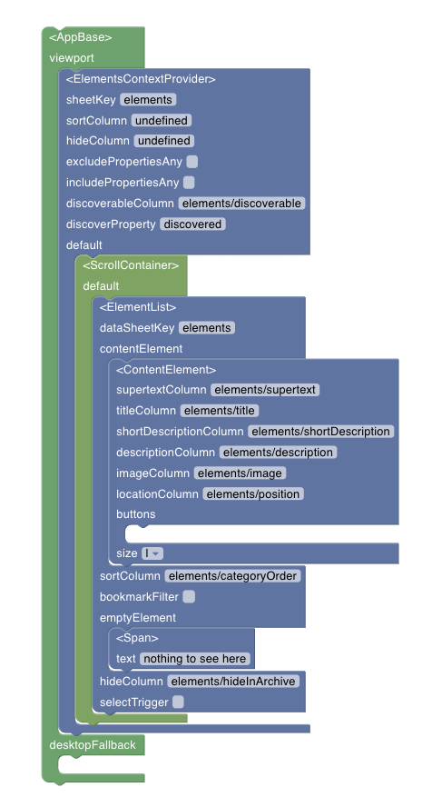

<script>
  import ComponentInfo from "../../components/ComponentInfo.svelte";
  import src from "../../../../../packages/interkit/components/ElementList.svelte?raw";
</script>

# ElementList

A list of `elements`.

# Usage

ElementsList needs to have an `ElementsContextProvider` somewhere in its ancestry.  
Child should be a `ContentElement`.

## Example

- AppBase
  - ElementsContextProvider
    - ScrollContainer
      - ElementList
        - ContentElement



```docs
../../../../../packages/interkit/components/ElementList.svelte
```

<ComponentInfo code={src} />
