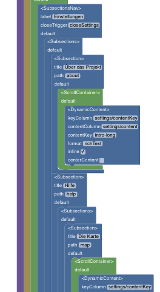

<script>
  import ComponentInfo from "../../components/ComponentInfo.svelte";
  import src from "../../../../../packages/interkit/components/Subsection.svelte?raw";
</script>

# Subsection

## usage

Page in a nested settings menu. The whole tree needs to be wrapped once in [SubsectionsNav](SubsectionsNav), and each level in the hierarchy is wrapped in Subsections component.

You can specify a path that you can use in an action to open the menu at a specific page, for example

```javascript
InterkitClient.setUiKey("menuPath", "help/map")
```

Help would be top level subsection, map the subsection on the second level you want to open.




```docs
../../../../../packages/interkit/components/Subsection.svelte
```

<ComponentInfo code={src} />
