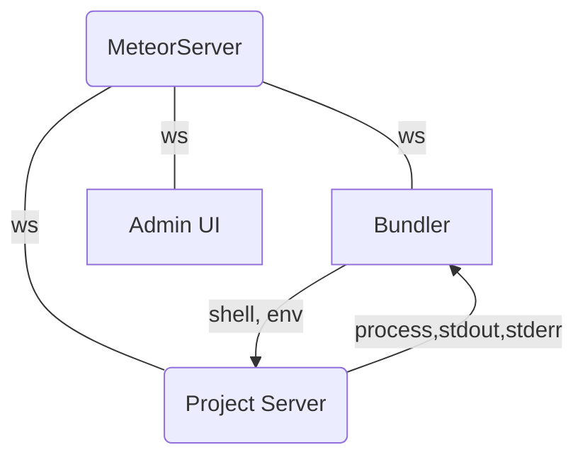

# Project server

The `Project Server` is a node application that runs the server-side code of a project. Things like
- replying to chat messages
- changing the project database

```mermaid
    graph TD

    Bundler[Bundler]
    Project(Project Server)
    Server(MeteorServer)
    Admin[Admin UI]
    
    Bundler -->|shell, env| Project
    Project --> |process,stdout,stderr| Bundler
    Server --- |ws| Project
    Server --- |ws| Admin 
    Server --- |ws| Bundler 
```